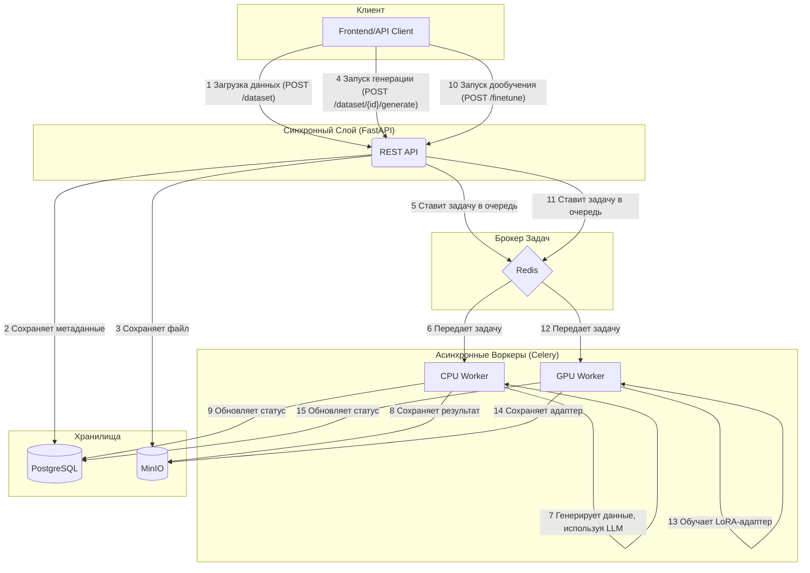

# FRD.ai - From Raw Data to AI

**FRD.ai** — это SaaS \ on-premise платформа, предназначенная для автоматизации процесса дообучения (fine-tuning) и развертывания языковых моделей (LLM) под конкретные доменные задачи.

[](https://www.python.org/downloads/)
[](https://fastapi.tiangolo.com/)
[](https://www.docker.com/)

## 🚀 Ключевые цели (Key Goals)

1.  **Автоматизация дообучения:** Позволить пользователям без экспертизы в ML дообучать LLM.
2.  **Повышение качества моделей:** Улучшать метрики моделей в рамках узкого домена.
3.  **Сохранность данных:** Обеспечить полный контроль над данными, разворачивая платформу `on-premise`.
4.  **Простое развертывание:** Автоматически упаковывать обученные модели в готовые к развертыванию Docker-контейнеры.
5.  **Непрерывное улучшение:** Реализовать механизм `Direct Preference Optimization` (DPO) для дообучения на основе фидбэка.

## 🏛️ Архитектура (Architecture)

Платформа разделена на синхронный **REST API (FastAPI)** и асинхронные **"тяжелые" воркеры (Celery)**. Это позволяет API оставаться отзывчивым, в то время как ресурсоемкие задачи выполняются в фоне.



## 🛠️ Технологический стек (Tech Stack)

-   **Веб-фреймворк:** **FastAPI**
-   **Фоновые задачи:** **Celery** (с двумя очередями: `cpu_queue` и `gpu_queue`)
-   **Брокер сообщений:** **Redis**
-   **База данных:** **PostgreSQL** (для хранения метаданных)
-   **Хранилище объектов:** **MinIO** (для датасетов, моделей и артефактов)
-   **Фронтенд:** **Streamlit** (для демонстрации и управления)
-   **Контейнеризация:** **Docker** и **Docker Compose**

## 🏁 Как запустить (Getting Started)

Для запуска платформы вам понадобятся **Docker** и **Docker Compose**.

1.  **Клонируйте репозиторий:**
    ```bash
    git clone <your-repo-url>
    cd jmlc
    ```

2.  **Создайте файл `.env`:**
    Скопируйте `.env.example` (если он есть) или создайте новый файл `.env` в корне проекта. В него нужно добавить ваш `GOOGLE_API_KEY` для работы генератора данных.
    ```
    GOOGLE_API_KEY="your_google_api_key_here"
    ```

3.  **Запустите все сервисы с помощью Docker Compose:**
    ```bash
    docker-compose up --build -d
    ```
    Эта команда соберет все образы и запустит контейнеры в фоновом режиме.

4.  **Готово!** Платформа запущена.

## 🌐 Доступные сервисы (Available Services)

После запуска вам будут доступны следующие сервисы:

-   **FastAPI Backend:** `http://localhost:7777`
-   **Документация API (Swagger):** `http://localhost:7777/docs`
-   **Streamlit Frontend:** `http://localhost:8501`
-   **MinIO Console:** `http://localhost:9001` (логин: `minioadmin`, пароль: `minioadmin`)
-   **PostgreSQL:** `localhost:5432`
-   **Redis:** `localhost:6379`

## 📂 Структура проекта (Project Structure)

Проект разделен на несколько ключевых модулей:

-   [`/src`](./src/README.md): Основное FastAPI приложение (синхронный API).
-   [`/worker`](./worker/README.md): Асинхронные Celery воркеры для выполнения тяжелых задач.
-   [`/shared`](./shared/README.md): Общий код, используемый `src` и `worker` (репозитории, клиенты и т.д.).
-   [`/frontend`](./frontend/README.md): Streamlit-приложение для взаимодействия с платформой.
-   [`/data`](./data/prompt/README.md): Шаблоны промптов и другие данные.
-   [`/deployment`](./deployment/README.md): HelmChart, ArgoCD манифесты для деплоя приложения в k8s.
-   `docker-compose.yml`: Определяет все сервисы, их взаимодействие и переменные окружения.
-   `Dockerfile`: Инструкции для сборки Docker-образа основного API.